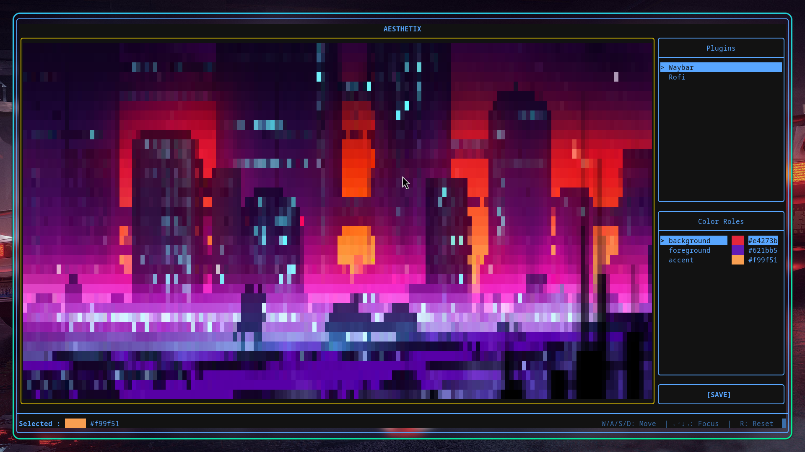

# Aesthetix

<p align="center">
  <br/>
  <em>Select colors from an image and apply them using plugins</em>
</p>

**Aesthetix** is a terminal UI (TUI) application for extracting colors from an image and applying them to different UI components (Waybar, Rofi, etc.) using a simple plugin system.

It lets you:
- Pick colors from an image
- Assign them to semantic roles (background, foreground, accent, …)
- Apply them using user-defined scripts

---

## Installation

### Clone the repository

```bash
git clone https://github.com/rustypointer/aesthetix.git
cd aesthetix
```

### Build

```bash
cmake -S . -B build
cmake --build build
```

### Install (system-wide)

```bash
sudo cmake --install build
```

After installation, run:

```bash
aesthetix
```

### Install locally (no sudo)

```bash
cmake -S . -B build -DCMAKE_INSTALL_PREFIX=$HOME/.local
cmake --build build
cmake --install build
```

Make sure `~/.local/bin` is in your `PATH`.

---

## Usage

```bash
aesthetix <image_path>
```

Example:

```bash
aesthetix ~/Pictures/wallpaper.jpg
```

If the image cannot be loaded, the application exits with an error message.

---

## Plugin System

Plugins live in:

```text
~/.config/aesthetix/plugins/
```

Each plugin is a directory (for example `waybar`, `rofi`, etc.) containing:

- `manifest.json`
- an apply script (for example `script.sh`)

### Example structure

```text
~/.config/aesthetix/plugins/
└── waybar/
    ├── manifest.json
    └── script.sh
```

---

## Plugin Manifest

Each plugin must define a `manifest.json` file describing the plugin.

### Example `manifest.json`

```json
{
  "name": "Waybar",
  "colors": [
    "background",
    "foreground",
    "accent"
  ],
  "apply": "script.sh"
}
```

### Fields

- **name**  
  Display name shown in the UI.

- **colors**  
  List of color roles required by the plugin.

- **apply**  
  Script file (relative to the plugin folder) that will be executed.

---

## Output Colors File

When applying a plugin, Aesthetix writes the selected colors to:

```text
~/.cache/aesthetix/output/colors.json
```

### Example output

```json
{
  "colors": {
    "accent": "#1f3854",
    "background": "#1d334a",
    "foreground": "#1f3854"
  }
}
```

This file maps color roles to their selected hex values.

---

## Apply Script

The apply script specified in `manifest.json` receives the generated colors JSON file and should:

- Read `~/.cache/aesthetix/output/colors.json`
- Extract the required color values
- Apply them to the target application (Waybar, Rofi, etc.)

The script can be written in any language (shell, Python, etc.), as long as it can read JSON.

---

## Notes

- Plugin directories are created automatically if missing.
- Each plugin is fully independent.
- No hardcoded configuration is required beyond the plugin folders.

---

## License

MIT
